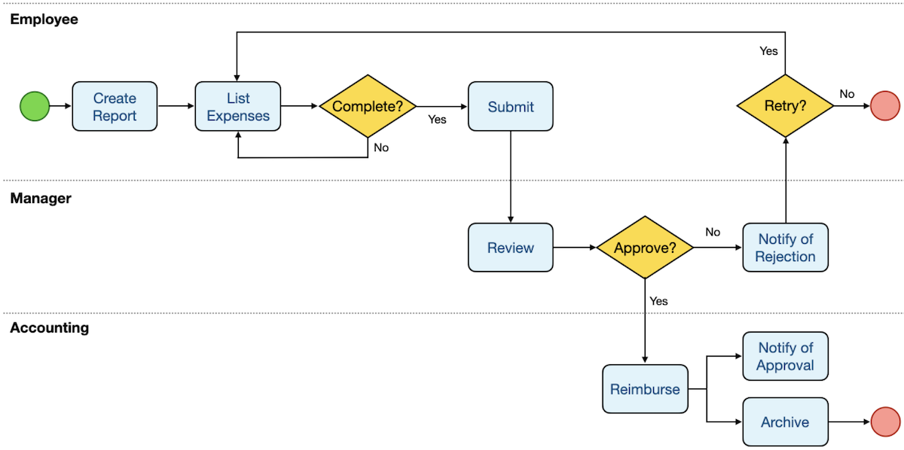

# Pengenalan Temporal

## Apa itu Temporal ?

Temporal merupakan platform open source yang dapat membantu untuk mengoptimalisasi aplikasi yang dirancang agar dapat mengatasi kegagalan eksekusi dengan cara memulihkan eksekusi tersebut, sebelum eksekusi terjadi kegagalan.

## Bagaimana Alur Kerja Temporal ?

Temporal dapat berjalan selama mungkin, walaupun jika infrastruktur yang mendasarinya mengalami kerusakan. Jika terjadi kegagalan, Temporal akan secara otomatis membuat ulang keadaan sebelumnya sebelum gagal, sehingga dapat melanjutkan untuk menjalankan alur program sebelum mengalami kegagalan.

## Contoh Alur Kerja

### Laporan Pengeluaran

<figure><figcaption></figcaption></figure>

Pertama, Anda membuat laporan, menjelaskan barang yang Anda beli, melampirkan tanda terima jika perlu, lalu Anda mengirimkannya. Manajer kemudian meninjaunya, baik menolaknya (dalam hal ini Anda akan diberi tahu sehingga Anda dapat memperbaiki masalah dan mengirimkannya kembali jika perlu) atau menyetujuinya. Jika disetujui, departemen akuntansi akan memprosesnya, mengganti biaya Anda dengan mengirimkan cek atau setoran langsung, dan kemudian memberi tahu Anda bahwa mereka telah melakukannya. Mereka juga akan mengarsipkan laporan ini sehingga tersedia jika ada audit.
